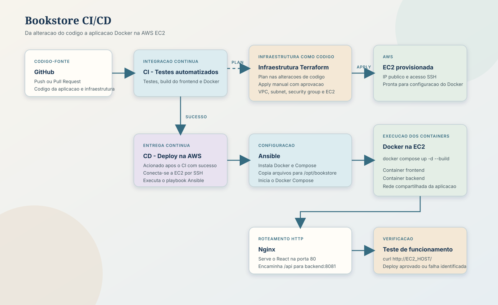
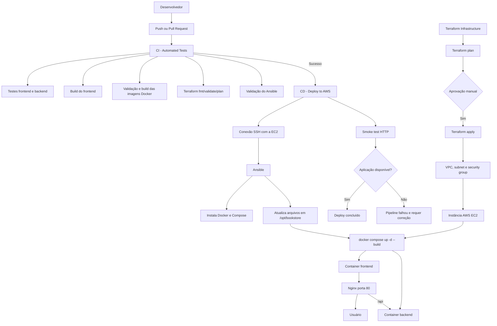

# Fluxo CI/CD da Bookstore

## Desenho do fluxo

## Resumo

O fluxo começa quando o desenvolvedor envia um `push` ou abre um Pull Request. O workflow **CI - Automated Tests** instala as dependências, executa os testes disponíveis do frontend, gera o build do React, valida o Docker Compose e constrói as imagens Docker.

A infraestrutura é tratada separadamente pelo workflow **Terraform Infrastructure**. Ele executa `terraform plan` automaticamente nas alterações da pasta `infra`. O `terraform apply` só é executado manualmente, com aprovação do environment `production`. O Terraform cria a VPC, as subnets públicas, o security group e a instância EC2.

Depois que a infraestrutura existe e o CI termina com sucesso, o workflow **CD - Deploy to AWS** conecta-se à EC2 por SSH e executa o Ansible. O Ansible instala e inicia o Docker, instala o Docker Compose, copia os arquivos da aplicação para `/opt/bookstore` e executa `docker compose up -d --build`.

A EC2 executa dois containers. O container frontend usa Nginx para servir os arquivos compilados do React na porta 80. O Nginx também encaminha requisições iniciadas em `/api` para o container backend, que executa a API Node.js na porta 8081.

Ao final, o workflow CD executa um smoke test HTTP contra a EC2. Se a resposta for bem-sucedida, o deploy é concluído. Caso contrário, o pipeline falha e a aplicação deve ser investigada.

## Responsabilidades

| Componente | Responsabilidade |
| --- | --- |
| GitHub Actions CI | Testes, build e validações |
| Terraform | Provisionamento da infraestrutura AWS |
| EC2 | Máquina que hospeda a aplicação |
| Ansible | Configuração da EC2 e execução do deploy |
| Docker | Empacotamento e execução dos serviços |
| Docker Compose | Orquestração dos containers na EC2 |
| Nginx | Frontend, proxy `/api` e porta HTTP 80 |
| Node.js/Express | API backend na porta 8081 |

## Ordem de execução

1. Executar o Terraform para criar ou atualizar a EC2.
2. Configurar `EC2_HOST`, `EC2_USER` e `SSH_PRIVATE_KEY` nos secrets do GitHub.
3. Enviar alterações para o repositório.
4. Aguardar o CI concluir com sucesso.
5. O CD executa o Ansible na EC2.
6. O Ansible inicia ou atualiza os containers Docker.
7. O CD confirma a disponibilidade da aplicação por HTTP.

O workflow `continuous-delivery.yaml`, que usa PM2 e SSH para um servidor genérico, não deve ser executado junto com o workflow AWS. Para esta arquitetura, o workflow correto é `continuous-delivery-aws.yaml`.
